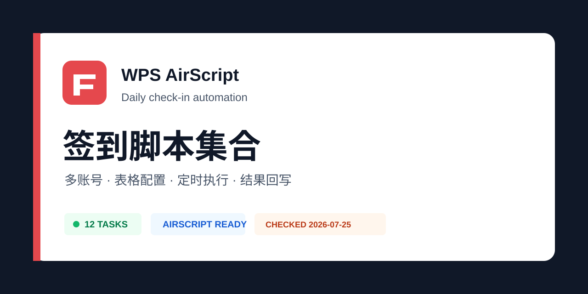

<p align="center">
    
    <br><strong><font size=50>签到脚本集合</font></strong>
    <br>基于【金山文档】的签到脚本
    <br>支持多账号使用、支持消息推送
</p>

<p align="center">
    <a href="https://github.com/poboll/wps_script/stargazers"></a>
    <a href="https://github.com/poboll/wps_script/network/members"></a>
    <a href="https://github.com/poboll/wps_script/issues"></a>
    <a href="https://wps-docs.caiths.com"></a>
</p>

## 前往 [说明文档wps-docs.caiths.com](https://wps-docs.caiths.com) [脚本仓库/wps_script](https://github.com/poboll/wps_script)

## 2026-07-25 维护更新

- 参考 [`Sitoi/dailycheckin`](https://github.com/Sitoi/dailycheckin/tree/135cc236e59ac4f14bcddc44acb3cbb3ed6010b5) 的当前实现，新增 AirScript 统一适配器 [`polymerization/dailycheckin.js`](./polymerization/dailycheckin.js)
- 适配 12 个候选任务；脚本支持多账号、结果回写和执行时间记录
- `UPDATE.js` 会自动创建 `dailycheckin` 配置表，不覆盖已有凭据
- AirScript 能力、适配范围和未适配原因见 [DailyCheckIn AirScript 适配说明](./docs/dailycheckin-airscript-cn.md)

> 当前维护验证不包含用户真实 Cookie。表中“已适配”表示已完成 AirScript 语法、请求参数和模拟响应检查，不等同于真实账号线上实测。

## 聚合脚本（polymerization）[聚合脚本教程](./polymerization.md)

文件夹“polymerization”为聚合脚本，运行UPDATE.js即可自动生成表格及配置内容。

### 聚合脚本优势

* 所有脚本及配置表格汇集在一个文档中，利于统一管理和配置
* 方便后续更新脚本，仅需运行UPDATE脚本即可自动新增最新表格及配置，不再需要手动新建表格框架
* 方便定时任务的添加与查看
* 支持仅推送错误消息、推送昵称等，支持更多的推送方式
* 配置灵活快捷，利于新增脚本及新配置功能
* 支持多脚本共用同一个表格，如WPS(轻量版)、WPS(客户端版)、WPS(稻壳版)脚本共用名称为wps的表格。

## 调试脚本（DEBUG、仅用于测试脚本错误）
文件夹“DEBUG”为适配聚合版脚本的调试脚本，如果运行聚合脚本出现问题，可复制此文件夹内的调试脚本并运行，可一定程度指出是何种错误。

## 非聚合脚本（独立脚本、single，非聚合脚本目前已不再维护）

文件夹“single”为独立脚本，需要手动创建表格。一个文档内只有一个脚本呢。

### 非聚合脚本表格内容参考

| cookie(默认20个) | 是否执行(是/否) | 账号名称(可不填写) | bark   | 是否推送(是/否) | pushplus | 是否推送(是/否) | ServerChan | 是否推送(是/否) |
| ---------------- | --------------- | ------------------ | ------ | --------------- | -------- | --------------- | ---------- | --------------- |
| xxxxxxxx1        | 是              | 昵称1              | xxxxxx | 否              | xxxxxx   | 否              | xxxxxx     | 否              |
| xxxxxxxx2        | 否              | 昵称2              |        |                 |          |                 |            |                 |

## 更多  

[IOS手机端获取cookie的方法可参考](./docs/ios-cn.md)

[Bark每日定时推送消息](./docs/bark-cn.md)

## 签到列表

🟢: 已有用户验证 🟡: 已完成 AirScript 适配，待真实凭据验证 🟠: 部分适配 🔴: 未适配或已失效

| 状态 | 任务 | 任务标识 / 脚本 | 检查日期 | 当前范围 |
| --- | --- | --- | --- | --- |
| 🟡 | [有道云笔记](https://note.youdao.com/) | `YOUDAO` | 2026-07-25 | 签到、广告空间 |
| 🟡 | [阿里云盘](https://www.aliyundrive.com/) | `ALIYUN` | 2026-07-25 | 刷新令牌、签到、领取奖励 |
| 🟡 | [百度网盘](https://pan.baidu.com/) | `BAIDUWP` | 2026-07-25 | 会员签到、每日答题、会员信息 |
| 🟡 | [Bilibili](https://www.bilibili.com/) | `BILIBILI` | 2026-07-25 | 登录检查、直播与漫画签到 |
| 🟡 | [V2EX](https://www.v2ex.com/) | `V2EX` | 2026-07-25 | 每日奖励、余额查询 |
| 🟡 | [AcFun](https://www.acfun.cn/) | `ACFUN` | 2026-07-25 | 每日签到、等级和香蕉查询 |
| 🟡 | [恩山无线论坛](https://www.right.com.cn/forum/) | `ENSHAN` | 2026-07-25 | formhash 签到 |
| 🟡 | [飞牛 NAS 社区](https://club.fnnas.com/) | `FNNASCLUB` | 2026-07-25 | 每日打卡 |
| 🟡 | [百度贴吧](https://tieba.baidu.com/) | `TIEBA` | 2026-07-25 | MD5 签名、关注贴吧逐吧签到 |
| 🟡 | [什么值得买](https://www.smzdm.com/) | `SMZDM` | 2026-07-25 | token 与 MD5 签名签到 |
| 🟠 | [爱奇艺](https://www.iqiyi.com/) | `IQIYI` | 2026-07-25 | 账号与成长信息；未启用高频抽奖 |
| 🟠 | [全民 K 歌](https://kg.qq.com/) | `KGQQ` | 2026-07-25 | 六类签到奖励请求；接口字段易变化 |
| 🔴 | i 茅台 | 未适配 | 2026-07-25 | 设备、定位和申购行为不适合普通签到脚本 |
| 🔴 | 小米运动 | 未适配 | 2026-07-25 | 涉及账号登录、数据修改和风控 |
| 🔴 | 百度站点提交 | 未适配 | 2026-07-25 | 属于站长工具，不是个人签到 |
| 🔴 | 奥拉星 | 未适配 | 2026-07-25 | 老旧活动接口且缺少可验证账号 |

以上 DailyCheckIn 任务统一使用 [`polymerization/dailycheckin.js`](./polymerization/dailycheckin.js)。原有历史脚本仍保留，但未在 2026-07-25 使用真实账号重新验证，不能沿用旧的绿色状态。

## 支持的通知列表

- Bark（iOS）
- 邮箱推送（内置/自定义）
- Server酱
- pushplus
- 邮箱
- 钉钉
- Discord

## 建议  

* 不同wps版本签到间隔30分钟  
* 定时任务时间尽量上午九点半之后  
* 定时任务尽量不设在同一时间  

## 致开发者

代码进行了模块化的开发，即使是**零开发经验、无代码基础**也能根据以下教程快速编写出所需脚本。
文件简要解释：UPDATE.js脚本（更新脚本）能够自动创建表格、自动填充缺失内容，不会覆盖原有数据
除此脚本外，都是自动化脚本。

### 新增脚本步骤：

1. 向UPDATE.js脚本中写入新脚本的表格配置数据
   如原来表格信息是这样

```javascript
// 分配置表名称
var subConfigWorkbook=['aliyundrive_multiuser','52pojie'];
// CONFIG表内容
var configContent=[
  ['工作表的名称','备注','只推送失败消息（是/否）','推送昵称（是/否）'],
  ['aliyundrive_multiuser','阿里云盘（多用户版）','否','否'],
  ['52pojie','吾爱破解','否','否'],
]
```

假设需要添加有道云笔记的脚本（英文noteyoudao）,则修改为如下。

```javascript
// 分配置表名称
var subConfigWorkbook=['aliyundrive_multiuser','52pojie','noteyoudao'];
// CONFIG表内容
var configContent=[
  ['工作表的名称','备注','只推送失败消息（是/否）','推送昵称（是/否）'],
  ['aliyundrive_multiuser','阿里云盘（多用户版）','否','否'],
  ['52pojie','吾爱破解','否','否'],
  ['noteyoudao','有道云笔记','否','否'],
]
```

此时若运行UPDATE.js脚本，则会在CONFIG表（主配置表）中看到新增了一行有道云笔记的配置，并且新增了名称为noteyoudao的表

2. 新建自动化脚本，名称需要和步骤1中新增的表名称一致。如上述的noteyoudao.js。可以直接复制已有的自动化脚本，在此基础上修改。
   例如修改52pojie脚本为新增的noteyoudao脚本
   在脚本开头的几行会有此脚本的基础信息，将其修改
   原脚本为：

```javascript
let sheetNameSubConfig = "52pojie"; // 分配置表名称
let pushHeader = "【52pojie】";
```

修改后脚本为：

```javascript
let sheetNameSubConfig = "noteyoudao"; // 这里需要和步骤1中的表名称一致
let pushHeader = "【有道云笔记】";  // 这里的内容可以随意填写，仅作为消息推送的备注
```

然后修改处于脚本最末尾的execHandle函数，根据抓包的内容（例如抓取签到的包，软件抓包也不需要代码基础，IOS端可用Stream工具、安卓端可用小黄鸟、PC端可用burp）填写如下标注的几处修改的地方即可。 原脚本大致内容会为：

```javascript
// 具体的执行函数
function execHandle(cookie, pos) {
  let messageSuccess = "";
  let messageFail = "";
  let messageName = "";
  if (messageNickname == 1) {
    messageName = Application.Range("C" + pos).Text;
  } else {
    messageName = "单元格A" + pos + "";
  }
  try {
    var url1 = "https://xxxxxx.com";    // 修改处①
    data ={                             // 修改处②，若是get请求则忽略此处
        "键":"值",
    }
    headers = {                         // 修改处③
      cookie: cookie,
      "键":"值",
    };

    let resp = HTTP.fetch(url1, {       // 可能修改处，若为post请求则用这块代码
      method: "post",
      headers: headers,
      data: data,
    });

    // let resp = HTTP.fetch(url1, {    // 可能修改处，若为get请求则用这块代码
    //   method: "get",
    //   headers: headers,
    // });

    if (resp.status == 200) {           // 可能修改处，按需对json格式修改。若不会修改，则可以忽略此处
      resp = resp.json();
      console.log(resp);
      messageSuccess += "帐号：" + messageName + "签到成功 " ;
      console.log("帐号：" + messageName + "签到成功 ");
    } else {
      console.log(resp.text());
      messageFail += "帐号：" + messageName + "签到失败 ";
      console.log("帐号：" + messageName + "签到失败 ");
    }
  } catch {
    messageFail += messageName + "失败";
  }

  sleep(2000);
  if (messageOnlyError == 1) {
    message += messageFail;
  } else {
    message += messageFail + " " + messageSuccess;
  }
  console.log(message);
}
```

例如修改为noteyoudao的脚本后的内容为

```javascript
// 具体的执行函数
function execHandle(cookie, pos) {
  let messageSuccess = "";
  let messageFail = "";
  let messageName = "";
  if (messageNickname == 1) {
    messageName = Application.Range("C" + pos).Text;
  } else {
    messageName = "单元格A" + pos + "";
  }
  try {
    var url1 = "https://note.youdao.com/yws/mapi/user?method=checkin";   // 修改了这里
    headers = { // 修改了这里
      cookie: cookie,   
      "User-Agent": "YNote",
      Host: "note.youdao.com",
    };

    let resp = HTTP.fetch(url1, {   // 修改了这里
      method: "post",
      headers: headers,
    });

    if (resp.status == 200) {   // 修改了这里
      resp = resp.json();
      console.log(resp);
      total = resp["total"] / 1048576;
      space = resp["space"] / 1048576;
      messageSuccess += "帐号：" + messageName + "签到成功，本次获取 " + space + " M, 总共获取 " + total + " M ";
      console.log("帐号：" + messageName + "签到成功，本次获取 " + space + " M, 总共获取 " + total + " M ");
    } else {
      console.log(resp.text());
      messageFail += "帐号：" + messageName + "签到失败 ";
      console.log("帐号：" + messageName + "签到失败 ");
    }
  } catch {
    messageFail += messageName + "失败";
  }

  sleep(2000);
  if (messageOnlyError == 1) {
    message += messageFail;
  } else {
    message += messageFail + " " + messageSuccess;
  }
  console.log(message);
}
```

此时就成功创建新脚本了。

## 特别声明

- 本仓库发布的脚本仅用于测试和学习研究，禁止用于商业用途，不能保证其合法性，准确性，完整性和有效性，请根据情况自行判断。

- 本人对任何脚本问题概不负责，包括但不限于由任何脚本错误导致的任何损失或损害。

- 间接使用脚本的任何用户，包括但不限于建立VPS或在某些行为违反国家/地区法律或相关法规的情况下进行传播, 本人对于由此引起的任何隐私泄漏或其他后果概不负责。

- 请勿将本仓库的任何内容用于商业或非法目的，否则后果自负。

- 如果任何单位或个人认为该项目的脚本可能涉嫌侵犯其权利，则应及时通知并提供身份证明，所有权证明，我们将在收到认证文件后删除相关脚本。

- 任何以任何方式查看此项目的人或直接或间接使用该项目的任何脚本的使用者都应仔细阅读此声明。本人保留随时更改或补充此免责声明的权利。一旦使用并复制了任何相关脚本或Script项目的规则，则视为您已接受此免责声明。

**您必须在下载后的24小时内从计算机或手机中完全删除以上内容**

> ***您使用或者复制了本仓库且本人制作的任何脚本，则视为 `已接受` 此声明，请仔细阅读***

## 代码参考
<a href="https://github.com/HeiDaotu/WFRobertQL">WFRobertQL</a>
<a href="https://github.com/kxs2018/daily_sign">daily_sign</a>
<a href="https://www.52pojie.cn/thread-1811357-1-1.html">@qike2391</a>
<a href="https://github.com/wd210010/just_for_happy">wd210010</a>

## README模板来源于
<a href="https://github.com/Sitoi/dailycheckin">dailycheckin仓库</a>
