# 有道云笔记自动签到

“金山文档”中AirScript能够执行用户编写的js代码，并且可以设置定时执行。因此通过编写指定代码，并加入自动到定时任务中，即可无成本自动执行所需脚本。

## 准备工作

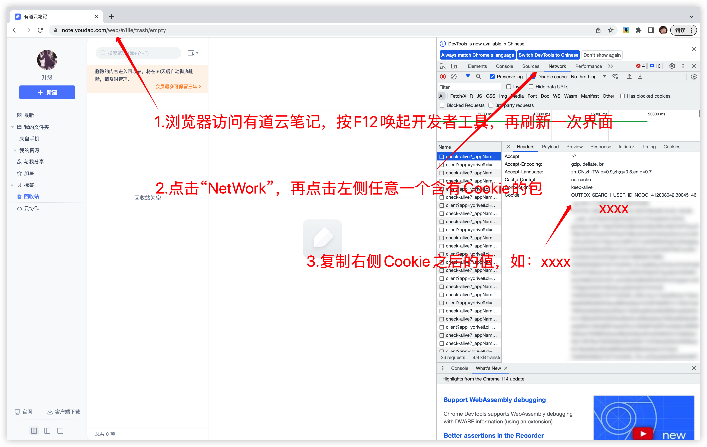

需要cookie。按照如图步骤复制cookie的值，如:xxxxxxxx。此值后面表格中需要用到。[IOS手机端获取cookie的方法可参考](./ios-cn.md)

文字步骤如下：

1. 第一步，浏览器访问网页版有道云笔记，网址为

```
https://note.youdao.com/web/
```

​	按键盘的F12，会唤起下方的开发者工具，再刷新一次页面。

2. 第二步，点击开发者工具中的"NetWork"(中文名叫"网络")，再点击下方出现的任意一个包含Cookie的包。

3. 第三步，右侧找到"Cookie",并复制它后面的内容，如：xxxxx

## 实际操作

1. 浏览器访问金山文档网址，并点击新建

```
https://www.kdocs.cn/latest?from=docs
```

2. 点击“表格”
3. 点击“空白表格”

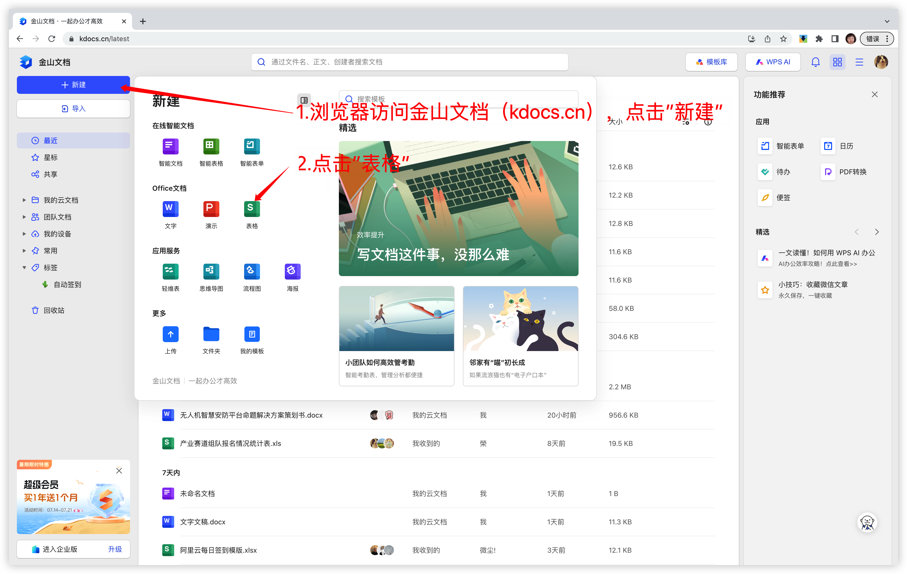

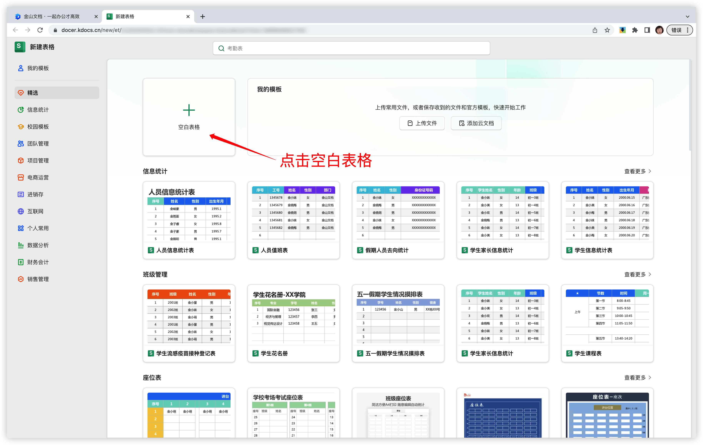

如图所示创建表格。

4.依次点击“效率”-“高级开发”-“AirScript脚本编辑器”

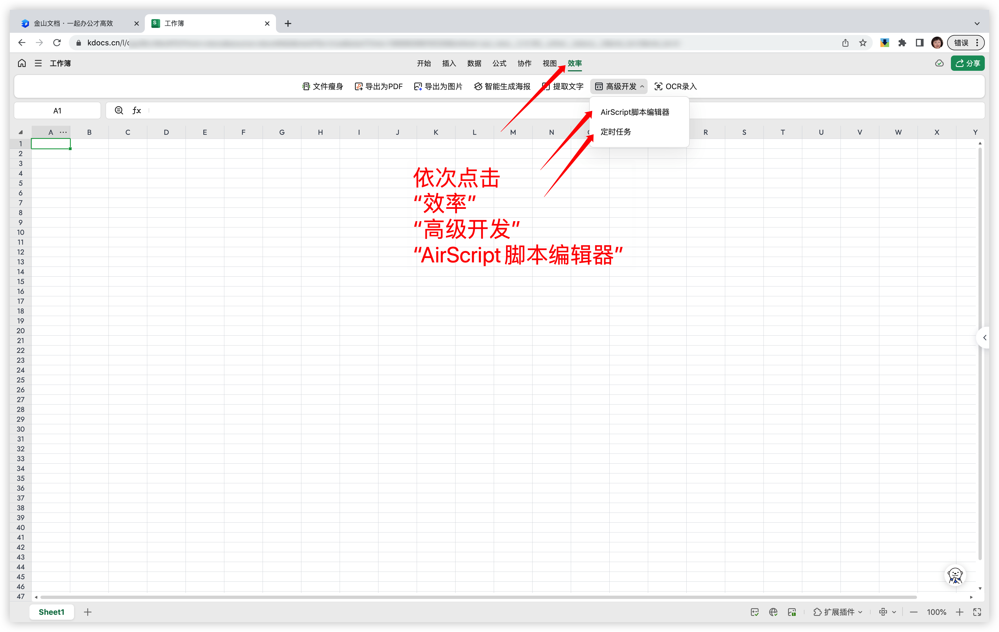

5.依次点击“创建脚本”-“文档共享脚本”

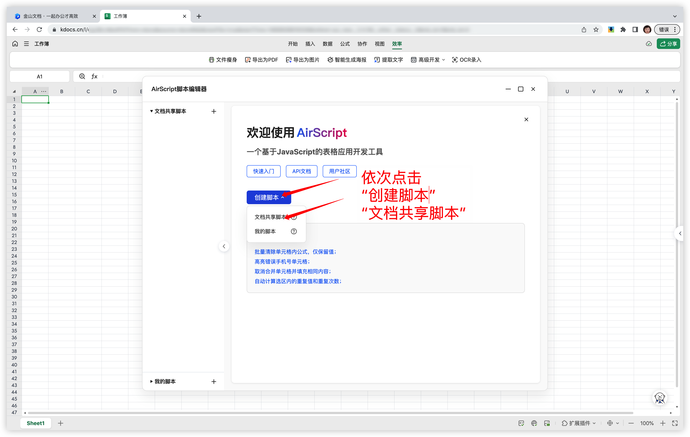

6.按图所示，点击“服务”-“添加服务”，再点击“网络API”对应的“添加”按钮

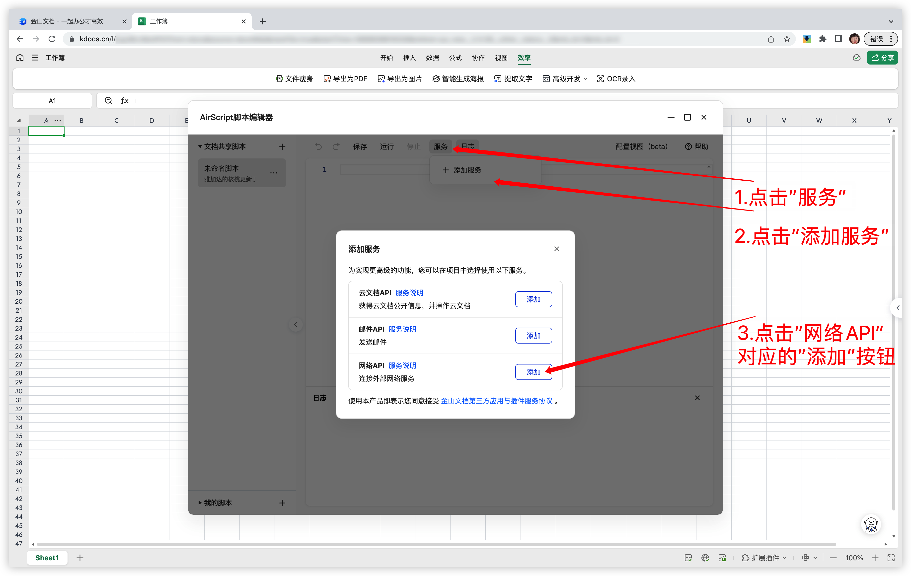

7.1 在表格内手动输入以下信息，将表格中的xxxxxxxx1、xxxxxxxx2替换为上述准备工作中自己多个账号的cookie值。按快捷键“Ctrl+S”保存。

表格内容如下（默认支持20个账号）。 

| cookie(默认20个) | 是否执行(是/否) | 账号名称(可不填写) | bark   | 是否推送(是/否) |
| ---------------- | --------------- | ------------------ | ------ | --------------- |
| xxxxxxxx1        | 是              | 昵称1              | xxxxxx | 否              |
| xxxxxxxx2        | 否              | 昵称2              |        |                 |

表格中bark的值获取方法在这篇文章有叙述，默认不推送消息，若需要推送，则将“是否推送”下方的值改为“是”。

[Bark每日定时推送消息](./bark-cn.md)

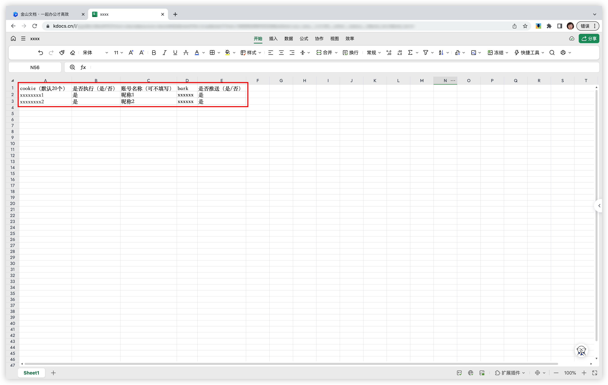

7.2 将以下代码复制到代码编辑框内，点击“保存”。

```javascript
// 推送bark消息
function bark(message){
  let bark_push = Application.Range("E"+2).Text
  if(bark_push == "是"){
    let bark_id = Application.Range("D"+2).Text
    let BARK_PUSH = 'https://api.day.app/' + bark_id + "/" + message;
    let barkdata = HTTP.get(BARK_PUSH,
      {headers:{'Content-Type': 'application/x-www-form-urlencoded'}}
    )
    barkdata = barkdata.json()
  }
}

function sleep(d){
  for(var t = Date.now();Date.now() - t <= d;);
}

var message= "【有道云笔记】";
var line = 21;  // 默认支持20个账户
var url1 = 'https://note.youdao.com/yws/mapi/user?method=checkin'
for (let i = 2; i <= line; i++){
  var cookie = Application.Range("A"+i).Text
  var exec = Application.Range("B"+i).Text
  if(cookie != "" && exec == "是"){
        try{
          headers = {
            'cookie': cookie,
            'User-Agent': 'YNote',
            'Host': 'note.youdao.com'
          }

          let resp = HTTP.fetch(url1,{
            method: "post",
            headers: headers
          })

          if (resp.status == 200) {
              resp = resp.json()
              total = resp['total'] / 1048576
              space = resp['space'] / 1048576
              message += '帐号：' + "单元格A" + i + '签到成功，本次获取 ' + space + ' M, 总共获取 ' + total + ' M '
              console.log('帐号：' + "单元格A" + i + '签到成功，本次获取 ' + space + ' M, 总共获取 ' + total + ' M ')
          }else
          {
            message += '帐号：' + "单元格A" + i + '签到失败 '
            console.log('帐号：' + "单元格A" + i + '签到失败 ')
          }
        }catch{
          console.log("单元格A" + i + "的cookie有误，请重新填写")
        }
      sleep(2000)
  }
}

bark(message);
```

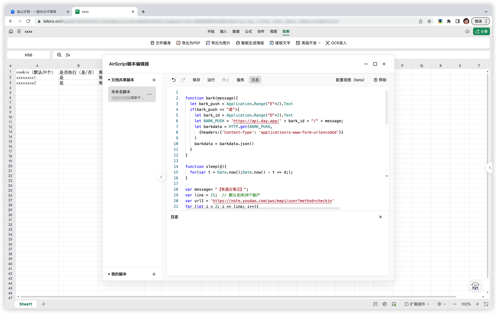

7.3 可点击“运行”进行测试，日志框中出现以下信息说明步骤正确。此测试步骤可忽略）

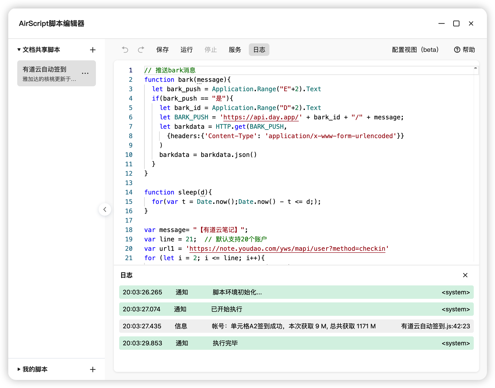

8.依次点击“高级开发”-“定时任务”，将刚刚的脚本添加到定时任务中。

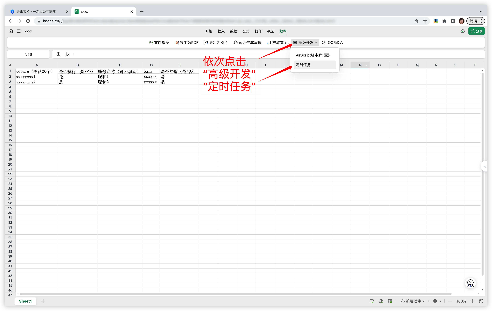

9.依次点击“创建任务”-“每天”，并选择刚刚的“未命名脚本”，此时就完成了，每天指定时间将会进行签到。

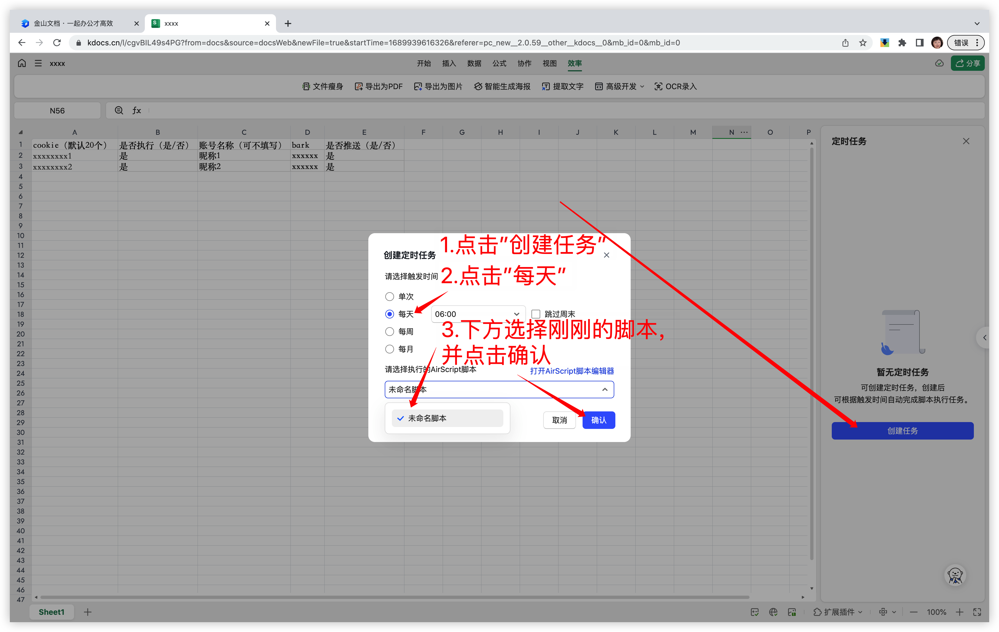

END