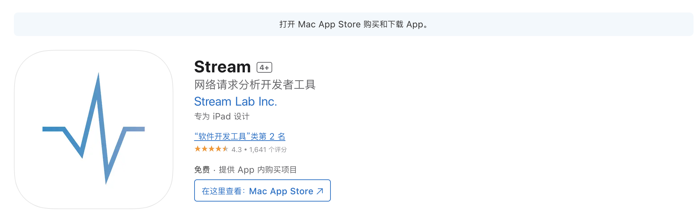

# IOS端免费的Stream抓包工具

## 简述

Stream可在苹果的App Store中免费下载，免费使用，不需要后续付费购买服务。以下是官方的功能介绍。

> Stream 用于客户端本地抓包，仅用于QA&开发本地网络调试。只是利用了iOS 9+的 Network Extension Api，其实不具备连接 vpn的功能

1. 抓取 HTTP&HTTPS 请求，其中HTTPS 请求需要配置 CA 证书
2. 访问抓包历史，预览请求体(request body)以及响应体(response body),目前支持文本/JSON/文件/表单。
3. 支持构建请求和请求重放
4. 支持配置 Hosts，实现在电脑端的Hosts 功能，用于前端开发以及移动端开发便捷的切换测试环境和线上环境。
5. 比较简单的支持打开HAR 通用标准文件，可以将 Charles/Fiddler/Chrome/Firefox 等网络记录导出 HAR然后在 Stream 打开并重放请求
6. 完美适配iPhone x 以及支持 iPadMutiTask。

## 准备工作

App Store中搜索并下载Stream，第一次下载完后按照软件的提示进行配置即可。