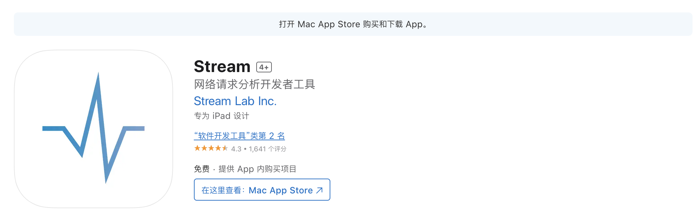

# iOS 获取 Cookie：Stream 抓包

网页能登录时优先使用[电脑端教程](./desktop-cn.md)。只有请求必须由 iPhone/iPad App 触发时，才临时安装抓包 CA。

> 检查日期：2026-07-26。只处理本人设备、本人账号的请求。Cookie 等同登录权限，不要发布抓包记录、截图或完整 Cookie。

## 准备

1. 从中国区 App Store 安装 [Stream](https://apps.apple.com/cn/app/stream/id1312141691)。其他地区账号可在 App Store 搜索 `Stream`，可用性以当前商店为准。
2. 先在目标 App 中登录，并从[每日任务说明](./daily-airscript-cn.md)确认所需域名和字段。
3. 抓包期间不要打开支付、银行或密码管理器等无关 App。



## 安装证书

1. 在 Stream 进入抓包页，首次启动时允许添加本机 VPN 配置。
2. 打开 Stream 的 HTTPS/CA 证书入口，按提示用 Safari 下载描述文件。
3. 打开 **设置 → 通用 → VPN 与设备管理**，选择刚下载的 Stream 描述文件并安装。
4. 打开 **设置 → 通用 → 关于本机 → 证书信任设置**。
5. 在“针对根证书启用完全信任”下开启刚安装的 Stream 根证书。
6. 回到 Stream，确认 HTTPS 证书状态正常。

Apple 明确说明，手动安装的证书描述文件不会自动获得 SSL/TLS 完全信任，必须在“证书信任设置”中单独开启。

## 抓取 Cookie

1. 清空 Stream 旧记录并开始抓包。
2. 立即切换到目标 App，进入账号页或刷新一次任务页。
3. 返回 Stream 并停止抓包。
4. 按目标域名筛选，打开一条本人账号的 HTTPS 请求。
5. 在 **Request → Headers** 找到 `Cookie`，复制冒号后的完整值。
6. 不要复制响应中的 `Set-Cookie`，也不要复制整份 cURL/HAR。

常见关键字段：

| 任务 | Cookie 中检查 |
| --- | --- |
| 百度网盘、百度贴吧 | `BDUSS=` |
| Bilibili | `SESSDATA=`；扩展功能还需 `bili_jct=` |
| V2EX | `A2=` |
| 爱奇艺 | `P00001=`；扩展流程可能还需 `P00003=` |
| 全民 K 歌 | `uid=` |
| 有道云笔记 | `YNOTE_PERS=` |

## 写入 WPS

普通任务把 Cookie 原文粘贴到 `daily` 表 B 列；带可选开关时写入 JSON 的 `cookie` 字段：

```json
{
  "cookie": "SESSDATA=REPLACE_ME; bili_jct=REPLACE_ME",
  "coin_num": 0,
  "vip_reward": false
}
```

把 C 列改为“是”，手动运行 `daily.js`。E 列会回写结果，F 列会回写时间；只有 E 列返回成功、已签到或正常账号信息，才能确认该凭据当前有效。

## 清理

1. 在 Stream 停止抓包并关闭 VPN。
2. 删除包含 Cookie 的抓包历史或导出文件。
3. 在“证书信任设置”关闭 Stream 根证书的完全信任。
4. 在“VPN 与设备管理”删除对应证书描述文件。
5. App 使用证书锁定或独立证书库时，不要尝试绕过，改用官方 Web 登录页。

完整网页版教程：[wps-docs.caiths.com/more/ios](https://wps-docs.caiths.com/more/ios)。

参考：[Apple 手动信任证书说明](https://support.apple.com/en-us/102390)。
